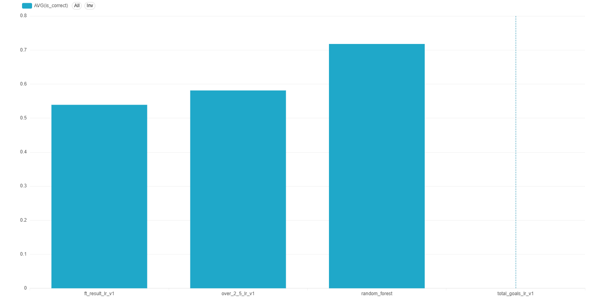
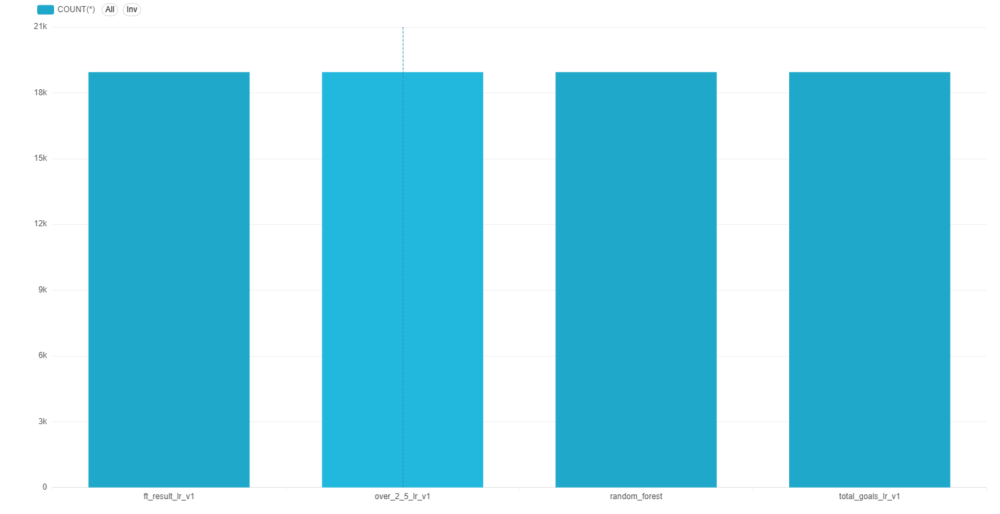
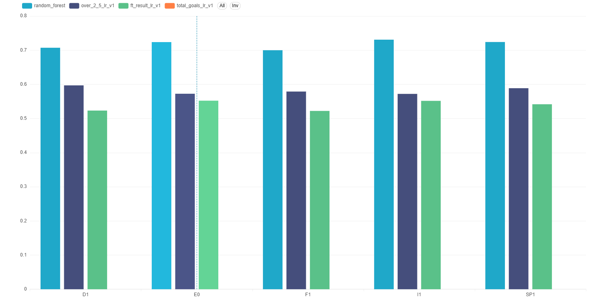
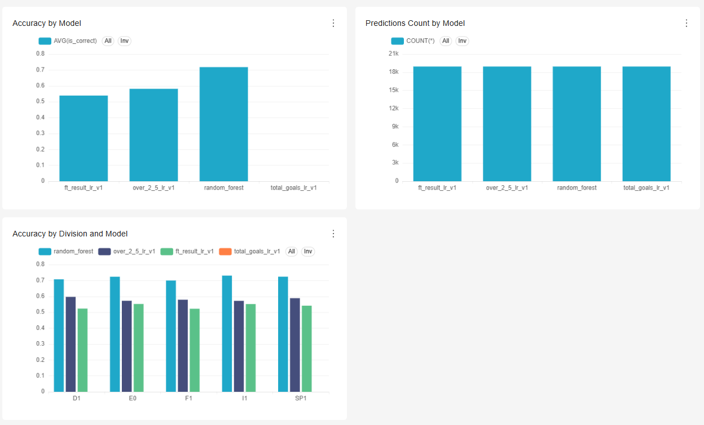

# ⚽ Football Analytics Platform

Production-like football analytics project built for a Data Science / Machine Learning portfolio, focused on **end-to-end match prediction**, **analytics storage**, and **dashboarding** using a clean, practical stack.

## Tech stack

- **Python 3**
- **Pandas**
- **scikit-learn**
- **ClickHouse**
- **Apache Superset**

This project is designed to grow in phases, from **club match prediction** to **team analytics**, **player-level modeling**, **national team modeling**, and eventually a **World Cup 2026 simulation engine**.

---

## ✅ Project status

### Phase 1 complete

Phase 1 covers the full club match prediction backbone:

- Match-level modeling
- Model training and saving
- Metadata artifacts
- Prediction storage in ClickHouse
- SQL analytics layer
- Superset dashboards

### Implemented prediction tasks

- **Home win** classification
- **Full-time result** multiclass classification
- **Over 2.5 goals** classification
- **Total goals** regression

---

## 🎯 Why this project

The goal is not only to train models, but to build a realistic, modular analytics platform that looks closer to a real product backend than a notebook-only project.

This project demonstrates:

- Reproducible ML pipelines
- Feature engineering for football data
- Model artifact management
- Prediction storage and analytics in ClickHouse
- BI/dashboard layer in Superset
- A roadmap toward advanced football intelligence use cases

---

## 🧰 Detailed stack overview

### Python
Used for:

- Pipelines
- Feature engineering
- Model training
- Evaluation
- Simulations

### Pandas
Used for:

- Data cleaning
- Joins
- Rolling statistics
- Pre-match feature engineering
- Aggregations

### scikit-learn
Used for:

- Baseline models
- `LogisticRegression`
- `RandomForestClassifier`
- `LinearRegression`
- Pipelines
- Evaluation

### ClickHouse
Used for:

- Prediction storage
- Feature analytics
- Model analytics
- Dashboard backend

### Apache Superset
Used for:

- Model monitoring dashboards
- Prediction analytics dashboards
- Future team, player, and tournament dashboards

---

## 🗺️ Phase roadmap

### Phase 1 — Club match prediction ✅

**Match-level prediction backbone**

Available raw and processed match data includes:

- Date
- Home team
- Away team
- Result
- Goals
- League / division
- Season
- Odds
- ELO
- Recent form features

Implemented tasks:

- **Home / draw / away**
- **Over / under**
- **Goals prediction**

### Phase 2 — Team analytics

Planned core feature layer:

- `wins_last_5`
- `points_last_5`
- `avg_goals_scored_last_5`
- `avg_goals_conceded_last_5`
- `home_win_rate_last_10`
- `away_win_rate_last_10`
- `rest_days`
- `h2h_last_5`
- `clean_sheet_rate`
- `failed_to_score_rate`

### Phase 3 — Player module

Planned tables and tasks:

- `players`
- `player_match_stats`
- `player_form_features`
- `player_predictions`

Planned prediction tasks:

- `will_score`
- `shots_prediction`
- `rating_prediction`

### Phase 4 — National teams

Planned national team layer:

- Recent national team form
- Results in last **N** matches
- Strength of opponents
- Squad quality
- Combined club form of players
- Lineup continuity
- Historical tournament performance

### Phase 5 — World Cup 2026 simulator

Final target capabilities:

- Define groups
- Define squads / expected lineups
- Estimate team strength
- Predict every match
- Simulate groups many times
- Estimate:
  - Chance to finish 1st
  - Chance to qualify
  - Chance to reach quarterfinals
  - Chance to win the tournament

---

## 📁 Project structure

```text
football-analytics-platform/
│
├── artifacts/
│   ├── metadata/
│   └── models/
│
├── dashboards/
├── data/
│   ├── raw/
│   ├── interim/
│   └── processed/
│
├── notebooks/
├── reports/
├── sql/
│   ├── ddl/
│   └── queries/
│
├── src/
│   ├── data/
│   ├── features/
│   ├── models/
│   │   └── experiments/
│   ├── storage/
│   └── utils/
│
├── superset/
├── tests/
├── .gitignore
├── docker-compose.yml
├── README.md
└── requirements.txt
```

---

## 📊 Available datasets

### `matches_v1_clean.csv`

Core Phase 1 modeling dataset.

Contains columns such as:

- `match_id`
- `division`
- `match_date`
- `home_team`
- `away_team`
- `home_elo`
- `away_elo`
- `form3_home`
- `form5_home`
- `form3_away`
- `form5_away`
- `ft_home`
- `ft_away`
- `ft_result`
- `odd_home`
- `odd_draw`
- `odd_away`
- `home_win`
- `draw`
- `away_win`
- `total_goals`
- `over_2_5`

### `matches_v2_features.csv`

Additional rolling features such as:

- `home_avg_goals_scored_last_5`
- `home_avg_goals_conceded_last_5`
- `home_points_last_5`
- `home_draw_rate_last_5`
- `away_avg_goals_scored_last_5`
- `away_avg_goals_conceded_last_5`
- `away_points_last_5`
- `away_draw_rate_last_5`

### `matches_v3_features.csv`

Overall rolling features through a team-centric approach, such as:

- `home_avg_goals_scored_last_5_overall`
- `home_avg_goals_conceded_last_5_overall`
- `home_points_last_5_overall`
- `home_draw_rate_last_5_overall`
- `away_avg_goals_scored_last_5_overall`
- `away_avg_goals_conceded_last_5_overall`
- `away_points_last_5_overall`
- `away_draw_rate_last_5_overall`

---

## 🧪 Current feature engineering

### Base derived features currently used in Phase 1

- `elo_diff`
- `form3_diff`
- `form5_diff`
- `elo_abs_diff`
- `form3_abs_diff`
- `form5_abs_diff`
- `odd_abs_diff`

### Additional features used for over/under and goals prediction

- `implied_home_prob`
- `implied_draw_prob`
- `implied_away_prob`
- `elo_sum`
- `form3_sum`
- `form5_sum`

### Additional overall rolling v3-style features prepared in the project

- `recent_goals_scored_diff_overall`
- `recent_goals_conceded_diff_overall`
- `recent_points_diff_overall`
- `recent_draw_rate_diff_overall`
- `recent_goals_scored_abs_diff_overall`
- `recent_goals_conceded_abs_diff_overall`
- `recent_points_abs_diff_overall`
- `recent_draw_rate_abs_diff_overall`

---

## 🤖 Phase 1 models

### 1) Home win classification

**Main model:** `RandomForestClassifier`  
**Model artifact:** `home_win_rf_v1.joblib`

**Stored-predictions performance in ClickHouse:**

- **Accuracy:** `0.7178`
- **Predictions:** `18943`

### 2) Full-time result multiclass classification

**Main model:** `LogisticRegression`  
**Model artifact:** `ft_result_lr_v1.joblib`

**Stored-predictions performance in ClickHouse:**

- **Accuracy:** `0.5390`
- **Predictions:** `18943`

### 3) Over 2.5 goals classification

**Main model:** `LogisticRegression`  
**Model artifact:** `over_2_5_lr_v1.joblib`

**Stored-predictions performance in ClickHouse:**

- **Accuracy:** `0.5812`
- **Predictions:** `18943`

### 4) Total goals regression

**Main model:** `LinearRegression`  
**Model artifact:** `total_goals_lr_v1.joblib`

**Training evaluation:**

- **MAE:** `1.2892`
- **RMSE:** `1.6144`
- **R²:** `0.0519`

**Stored-predictions analytics in ClickHouse:**

- **Average absolute error:** `1.3015`
- **Predictions:** `18943`

---

## 🔄 End-to-end backbone implemented

For Phase 1, the following full workflow is implemented:

1. Load processed dataset
2. Build derived features
3. Train model
4. Save model artifact
5. Save metadata JSON
6. Register model in model registry
7. Generate per-match predictions
8. Write predictions to ClickHouse
9. Analyze results with SQL
10. Visualize metrics in Superset

---

## 🗃️ Artifacts

### Model artifacts

Saved in:

```text
artifacts/models/
```

Examples:

- `home_win_rf_v1.joblib`
- `over_2_5_lr_v1.joblib`
- `ft_result_lr_v1.joblib`
- `total_goals_lr_v1.joblib`

### Metadata artifacts

Saved in:

```text
artifacts/metadata/
```

Examples:

- `home_win_rf_v1.json`
- `over_2_5_lr_v1.json`
- `ft_result_lr_v1.json`
- `total_goals_lr_v1.json`

These metadata files contain:

- Model name
- Target
- Task type
- Problem type
- Algorithm
- Feature list
- Dataset path
- Evaluation metrics
- Training/test row counts
- Timestamp

---

## 🏛️ ClickHouse layer

### Main table

Predictions are written into:

```sql
match_predictions
```

This table is used as the backend for analytics and dashboards.

### Current analytics supported

The platform supports analysis such as:

- Overall model accuracy
- Confidence buckets
- Accuracy by division
- Accuracy over time
- Best / worst teams for each model
- Highest-confidence wrong predictions
- Model summary
- Regression error analysis

---

## 🧾 SQL analytics layer

Implemented query files include:

- `sql/queries/confidence_buckets.sql`
- `sql/queries/accuracy_by_division.sql`
- `sql/queries/accuracy_over_time.sql`
- `sql/queries/best_worst_teams.sql`
- `sql/queries/highest_confidence_wrong_predictions.sql`
- `sql/queries/model_summary.sql`

Existing baseline project queries such as:

- `best_models.sql`
- `top_features_by_model.sql`
- `high_confidence_errors.sql`

These queries power model diagnostics and dashboard views.

---

## 📈 Superset dashboards

Superset is connected to ClickHouse and uses `match_predictions` as a dataset.

### Implemented dashboard

**Model Metrics Overview**

Contains:

- Accuracy by Model
- Predictions Count by Model
- Accuracy by Division and Model

## Dashboard Screenshots

The screenshots below showcase the current Superset dashboard layer used for model monitoring and prediction analytics.

### Accuracy by Model


### Predictions Count by Model


### Accuracy by Division and Model


### Model Metrics Overview Dashboard


---

## 🚀 How to run the project

### 1. Clone the repository

```bash
git clone <your-repo-url>
cd football-analytics-platform
```

### 2. Create and activate a virtual environment

#### Windows PowerShell

```powershell
python -m venv .venv
.\.venv\Scripts\Activate.ps1
```

#### macOS / Linux

```bash
python -m venv .venv
source .venv/bin/activate
```

### 3. Install Python dependencies

```bash
pip install -r requirements.txt
```

---

## 🐳 Docker services

This project uses Docker for infrastructure services:

- ClickHouse
- Superset
- Superset metadata database

Start services with:

```bash
docker compose up -d
```

Check running containers:

```bash
docker ps
```

Stop services:

```bash
docker compose down
```

---

## ⚙️ ClickHouse environment variables

When writing predictions from Python into ClickHouse, use:

```powershell
$env:CLICKHOUSE_HOST="localhost"
$env:CLICKHOUSE_PORT="8123"
$env:CLICKHOUSE_USER="default"
$env:CLICKHOUSE_PASSWORD="football123"
$env:CLICKHOUSE_DATABASE="football_analytics"
```

Quick check:

```bash
python -c "import os; print(os.getenv('CLICKHOUSE_HOST')); print(os.getenv('CLICKHOUSE_PORT')); print(os.getenv('CLICKHOUSE_USER')); print(os.getenv('CLICKHOUSE_PASSWORD')); print(os.getenv('CLICKHOUSE_DATABASE'))"
```

---

## 🏋️ Training scripts

### Home win

```bash
python src/models/train_and_save_home_win_rf.py
```

### Over 2.5 goals

```bash
python src/models/train_and_save_over_2_5_lr.py
```

### Full-time result

```bash
python src/models/train_and_save_ft_result_lr.py
```

### Total goals

```bash
python src/models/train_and_save_total_goals_lr.py
```

---

## 📝 Writing predictions to ClickHouse

### Home win

```bash
python -m src.storage.write_match_predictions --model-name home_win_rf_v1
```

### Over 2.5 goals

```bash
python -m src.storage.write_match_predictions --model-name over_2_5_lr_v1
```

### Full-time result

```bash
python -m src.storage.write_match_predictions --model-name ft_result_lr_v1
```

### Total goals

```bash
python -m src.storage.write_match_predictions --model-name total_goals_lr_v1
```

---

## 🔍 Example ClickHouse checks

### Count predictions by model

```bash
docker exec football_clickhouse clickhouse-client --user default --password football123 --database football_analytics --query "SELECT model_name, count() FROM match_predictions GROUP BY model_name ORDER BY model_name"
```

### Accuracy by model

```bash
docker exec football_clickhouse clickhouse-client --user default --password football123 --database football_analytics --query "SELECT model_name, round(avg(is_correct), 4) AS accuracy, count() FROM match_predictions WHERE is_correct IS NOT NULL GROUP BY model_name ORDER BY model_name"
```

### Regression error for total goals

```bash
docker exec football_clickhouse clickhouse-client --user default --password football123 --database football_analytics --query "SELECT model_name, target_name, round(avg(absolute_error), 4) AS avg_absolute_error, count() FROM match_predictions WHERE model_name = 'total_goals_lr_v1' GROUP BY model_name, target_name"
```

---

## 📊 Superset setup

Run Superset via Docker Compose and open it locally in the browser.

**Local URL:**

```text
http://localhost:8088
```

**Default local login used in this project:**

- **Username:** `admin`
- **Password:** `admin`

### Current workflow in Superset

1. Connect to ClickHouse
2. Create dataset from `match_predictions`
3. Create charts
4. Assemble dashboard

---

## 🏗️ Current architectural flow

```text
processed CSV data
    ↓
feature engineering in Python/Pandas
    ↓
scikit-learn training pipelines
    ↓
saved model artifacts + metadata JSON
    ↓
prediction generation
    ↓
ClickHouse storage
    ↓
SQL analytics layer
    ↓
Superset dashboards
```

---

## 💼 What makes this project portfolio-ready

This project is not just a collection of models. It demonstrates:

- Modular project structure
- Multiple prediction tasks on the same domain
- Model registry pattern
- Artifact management
- Analytics-first storage design
- SQL-based model monitoring
- BI/dashboard presentation layer
- Clear roadmap toward more advanced football intelligence systems

---

## 🔮 Next steps after Phase 1

Phase 1 is complete. The next planned step is **Phase 2 — Team analytics**, focused on richer pre-match team features:

- `wins_last_5`
- `points_last_5`
- `avg_goals_scored_last_5`
- `avg_goals_conceded_last_5`
- `home_win_rate_last_10`
- `away_win_rate_last_10`
- `rest_days`
- `h2h_last_5`
- `clean_sheet_rate`
- `failed_to_score_rate`

After that, the project will expand toward:

- Player-level modeling
- National team modeling
- World Cup 2026 tournament simulation

---

## ✍️ Author note

This project is being developed as a serious end-to-end football analytics portfolio platform, with emphasis on:

- Practical ML engineering
- Modularity
- Analytics usability
- Realistic project growth

The long-term goal is to evolve this into a complete football intelligence system with a dedicated **World Cup 2026 simulation module**.
